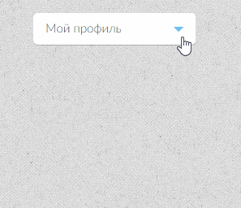

# Выпадающее меню

## Описание

Необходимо реализовать поведение выпадащего списка. При клике на кнопку «Мой профиль» (`
`) ниже должно появляться выпадающее меню. При повторном клике на кнопку или на один из пунктов выпадающего меню (`<li>`) оно должно закрыться:

## Интерфейс

Видимость выпадающего меню следует регулировать классом `active` на теге `
`.