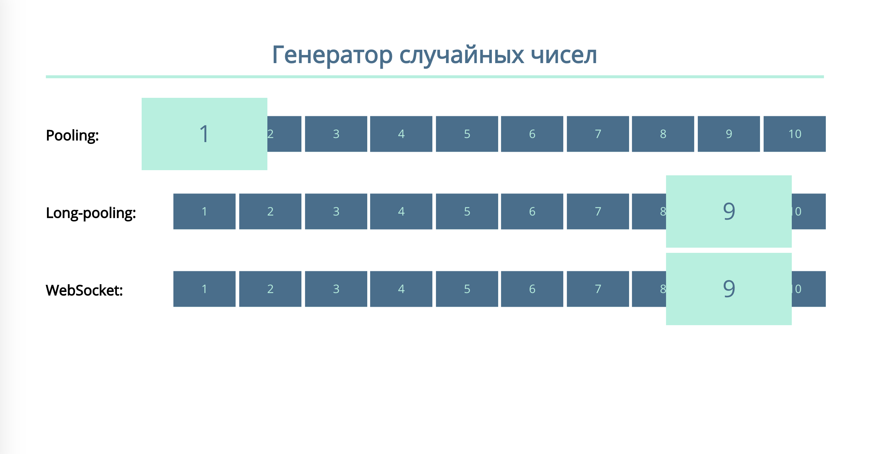

# Генератор случайных чисел

## Описание

Для наглядной демонстрации работы разных подходов реализации Comet-соединения я отображал случайные числа, генерируемые на веб-сервере, организовав их получение, используя «частые опросы», «длинные опросы» и веб-сокеты:

