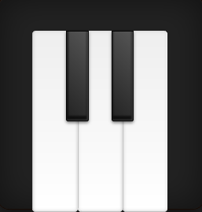

# Пианино

## Описание

Реализовал виртуальное пианино из 5 клавиш. Каждая из клавиш при клике проигрывает свой звук:

Пианино имеет 3 набора звуков: `lower`, `middle` и `higher.

Набор по умолчанию — `middle`.

При зажатой кнопке `shift` пианино работает в режиме `lower`.

При зажатой кнопке `alt` пианино работает в режиме `higher.

После того как кнопка `alt` или `shift` отпущена, пианино возвращается в режим `middle`.
