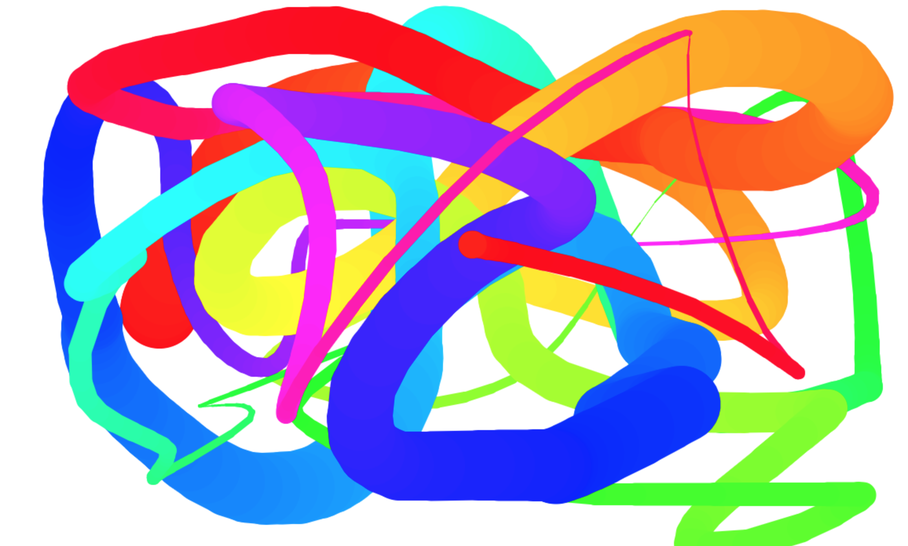

# Рисование в браузере

## Описание

Реализуйте примитивный инструмент рисования:

## Функционал

При движении по холсту мыши с нажатой левой кнопкой необходимо рисовать на холсте линию. 
Если кнопка мыши отпущена, то линия не рисуется. Если мышь вышла за пределы холста и потом вернулась, линия не рисуется. 