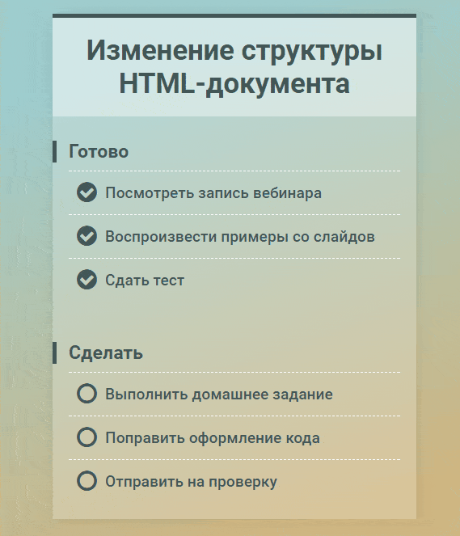

# Список дел (версия 2)

## Описание

Реализовал список дел, представляющий дела в виде двух групп: «Готово» и «Сделать». Если отметить дело в списке «Сделать» как выполненное, оно должно переместиться в список «Готово». Аналогично, дела, помеченные как не выполненные в списке «Готово», перемещаются в список «Сделать»:

