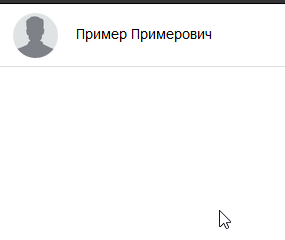

# Список контактов

## Описание

Написал скрипт, который отображает на странице список контактов на основе данных, полученных из функции `loadContacts`.

Список состоит из имен контактов. При клике на имя открывается карточка с контактными данными.  Можете проверить это на единственном элементе списка контактов, который дан для примера. И все будет работать с добавленными вами контактами, если вы правильно сформируете HTML-код и поместите его в подходящее место.

