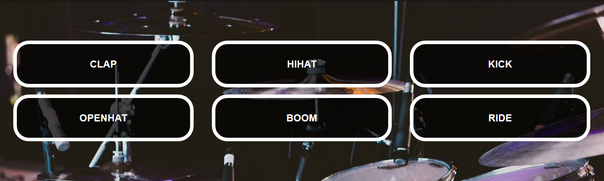

# Ударная установка

## Описание

При клике по кнопке `<li class="drum-kit__drum">` с названием звука воспроизвести соответствующий звук.

## Интерфейс

Для проигрывания звука следует обращаться к тегу `audio`, установленному в кнопке.