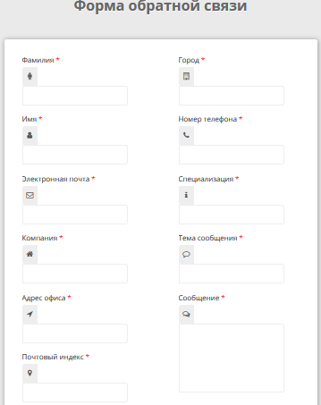

# Форма обратной связи

## Описание

Реализовал работу формы обратной связи. Она должна соответствовать следующим требованиям:

- Кнопка «Отправить сообщение» должна стать доступной, только если заполнены все поля формы.
- В поле «Почтовый индекс» необходимо запретить ввод чего-либо, кроме цифр. При этом все управляющие клавиши, например, `Enter`,  `Delete`, `BackSpace` и клавиши стрелок, должны работать.
- При отправке формы сама форма скрывается и показывается блок сообщения с заголовком «Ваше сообщение».
- В сообщение должны быть подставлены значения полей формы.
- При нажатии на кнопку «Изменить сообщение» блок сообщения должен быть скрыт, а форма — показана. При этом форма должна быть заполнена и функционировать так же, как при открытии.

