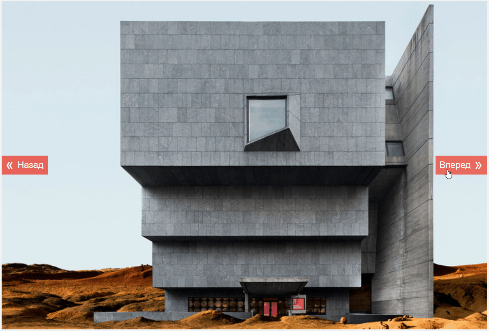

# Фотогалерея

## Описание

Необходимо реализовать фотогалерею, в которой пять фотографий можно пролистывать с помощью кнопок «вперед»/«назад»:

## Интерфейс

Фотографии должны показываться в теге ``.

Для перехода к следующей фотографии пользователь должен кликать по кнопке с идентификатором `nextPhoto`, а для перехода к предыдущей — `prevPhoto`.

Фотографии зациклены. Когда мы просматриваем последнюю фотографию и кликаем на кнопку «вперед», то показывается первая. Аналогично, если мы просматриваем первую и кликаем «назад», показывается последняя.
